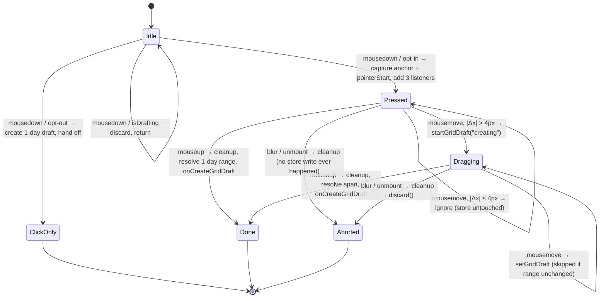

# Change Plan (delta) — Multi-day drag-to-create in the Week all-day row

- **Run:** `20260820-091709-feature-extend-weekbody-multiday-drag`
- **Mode / intent:** brownfield · `feature-extend`
- **Baseline:** `4189de1` on `CMP-101/opus-only`
- **Gate 0 carried in:** shared-hook **option (a)** — additive opt-in on `useAllDayDraftCreation`;
  `packages/web/src/views/Day/**` off-limits.
- **Requirements:** `requirements.md` (17 FR / 8 NFR / 14 AC, approved at Gate 1)

---

## 1. Summary

`useAllDayDraftCreation` gains one optional boolean, `isMultiDayDragEnabled`. When it is on, the
returned `onMouseDown` starts a window-level mouse gesture modelled byte-for-byte on
`useTimedDraftCreation.ts` (capture-phase `mousemove`/`mouseup`, window `blur`, `hasMoved` /
`isCancelled` / `isFinished` / `isPreviewStarted`, `cleanup()`, `gestureRef` cancelled on unmount)
that resolves a day range from `clientX` alone and writes the running span into the draft store as
the preview. When it is off — the Day view's call shape — the hook is byte-identical to today: no
listeners, one-day draft on mousedown. The range normalisation moves into a new pure module,
`grid/interaction/math/all-day.create.ts`, so FR-4/FR-5 get unit tests with no RTL. Week wires the
opt-in through a new 20-line wrapper, `useAllDayGridDraftCreation.ts`, mirroring the existing
`useTimedGridDraftCreation.ts`.

The change is small because **the rendering side is already done**: the store draft *is* the
preview (see §3, finding A). Ten files; four of them are new, two of those are tests, one is a doc,
one is `.gitignore`.

---

## 2. Decisions (ADR-style)

### D1 (Q1) — Range math is extracted to a pure module

- **Decision.** Create `packages/web/src/grid/interaction/math/all-day.create.ts` exporting
  `resolveAllDayCreateRange` and `isSameAllDayCreateRange`. The hook calls it; the hook contains no
  date arithmetic.
- **Context.** FR-4 (normalised min/max range), FR-5 (exclusive end), NFR-7 (idempotent under
  repeated application with an unchanged pointer). Both existing math neighbours live in this
  directory (`all-day.resize.ts`, `timed.resize.ts`).
- **Rationale.** The reverse-drag, same-column, and exclusive-end rules are the only genuinely
  error-prone logic in this change, and every one of them is a two-string-in / two-string-out
  assertion. Behind the hook they cost an RTL render, a store, and a fake pointer per case; in a
  pure module they cost one `expect` each in a `.test.ts` with no jsdom. NFR-7's "branch only on
  values captured at press time" is trivially provable for a pure function whose only inputs are
  `anchorDate` (captured at mousedown, never rewritten) and the live `pointerDate`.
- **Alternative rejected.** Inline in the hook (one fewer file). Rejected: it puts FR-4/FR-5 behind
  a gesture harness, and it repeats the `useTimedDraftCreation` mistake of a 30-line
  `resolveDraftForPointer` closure that no unit test can reach.
- **Reuse note (verified).** `all-day.resize.ts:86` `resizeFromStart` and `:103` `resizeFromEnd`
  are **module-private** — declared `const`, not exported — and `all-day.resize.ts` is **not** in
  the allowlist, so their export list cannot be widened. They also operate on day *indices* inside
  an `AllDayResizeVisual`, not on date strings, so they would not fit unchanged. The new module
  therefore re-states the ~6-line min/max normalisation over date strings. Duplication is
  deliberate and bounded.
- **Consequence.** One new source file plus one new test file. `all-day.resize.ts` is untouched.

### D2 (Q2) — Opt-in is a boolean flag on the existing options object

- **Decision.** Add `isMultiDayDragEnabled?: boolean` to `UseAllDayDraftCreationOptions`. The
  existing `getStartDate` stays the single pointer→date resolver for both paths. The hook keeps
  returning a bare arrow function.
- **Context.** FR-1 (additive, default-off), FR-2 (return must stay
  `(event: ReactMouseEvent<HTMLElement>, calendarId?: CalendarId | null) => void` — both call sites
  pass it straight in as `onMouseDown`, and `DayCalendarGrid.tsx:331` cannot be edited).
- **Rationale.** The caller already owns the pointer→date mapping and both callers already return
  a `YEAR_MONTH_DAY_FORMAT` string — verified: Week `AllDayRow.tsx:48-54`
  (`dateCalcs.getDateStrByXY(clientX, clientY, startOfView, YEAR_MONTH_DAY_FORMAT)`) and Day
  `DayCalendarGrid.tsx:249-250` (`dateCalcs.getDateStrByXY(clientX, 0, YEAR_MONTH_DAY_FORMAT)`).
  A second resolver would be a second source of truth for the same mapping.
- **Alternative rejected.** A `multiDayDrag?: { getDateForPointer(clientX): string }` sub-object.
  Rejected: it duplicates `getStartDate`, and it lets the two resolvers drift so a drag could
  resolve a different column than the press.
- **Alternative rejected.** Returning `{ startAllDayDraftCreation }` to mirror
  `useTimedDraftCreation`. Forbidden by FR-2 — it would require editing off-limits
  `DayCalendarGrid.tsx`.
- **Consequence.** `useRef`/`useEffect` now run in the hook on every render including Day's, but
  register nothing and leave `gestureRef.current === null` when the flag is off.

**Exact call sites, before/after:**

```ts
// packages/web/src/views/Week/components/Grid/AllDayRow/AllDayRow.tsx — BEFORE (48-61)
const getAllDayDraftStartDate = (clientX: number, clientY: number) =>
  dateCalcs.getDateStrByXY(clientX, clientY, startOfView, YEAR_MONTH_DAY_FORMAT);
const openAllDayDraft = (draft: GridEventDraft) => {
  draftActions.startGridDraft({ activity: "gridClick", draft });
};
const onMouseDown = useAllDayDraftCreation({
  getStartDate: getAllDayDraftStartDate,
  onCreateGridDraft: openAllDayDraft,
});

// AFTER
const onMouseDown = useAllDayGridDraftCreation({ dateCalcs, startOfView });
```

```ts
// packages/web/src/views/Day/components/Calendar/DayCalendarGrid.tsx:331 — BEFORE == AFTER
// (off-limits; not edited; compiles unchanged because the new option is optional)
const onAllDayMouseDown = useAllDayDraftCreation({
  getStartDate: getAllDayDraftStartDate,
  onCreateGridDraft: openGridDraftForm,
});
```

### D3 (Q3) — Yes, a Week-local wrapper hook is added

- **Decision.** Add `packages/web/src/views/Week/hooks/grid/useAllDayGridDraftCreation.ts`,
  mirroring `useTimedGridDraftCreation.ts` (20 lines, verified). It owns the
  `getDateStrByXY(..., YEAR_MONTH_DAY_FORMAT)` adapter, the `activity: "gridClick"` handoff, and
  `isMultiDayDragEnabled: true`, and returns the same callable `AllDayRow` passes down today.
- **Context.** FR-13, FR-14 (`AllDayRowRenderProps.onAllDayMouseDown` keeps
  `(event: MouseEvent<HTMLElement>) => void`).
- **Rationale.** Two reasons, one structural and one about testability. Structural: the timed side
  already extracted exactly this shape; leaving the all-day side inlined in a presentational
  component is the asymmetry a reader trips over. Testability: the *only* assertion that
  "Week opts in, and a finished drag opens with `activity: "gridClick"`" needs a mount point.
  Mounting `AllDayRow` drags in `useWeekEventViewModel` (react-query), `Measurements_Grid`, and a
  full `WeekProps`; mounting the wrapper needs a four-function `DateCalcs` stub and a `Dayjs`.
  `WeekView.render.test.tsx` is a 21-line `useScroll` test, not a view harness — verified.
- **Alternative rejected.** Set `isMultiDayDragEnabled: true` inline in `AllDayRow.tsx`. Rejected:
  the opt-in then has no test that does not require a Week-sized harness.
- **Deliberate deviation.** The wrapper takes `{ dateCalcs, startOfView }`, not
  `{ dateCalcs, weekProps }` as `useTimedGridDraftCreation` does. `useDateCalcs.ts:25-32` shows
  `getDateStrByXY`'s third argument is `_firstDayInView` — underscore-prefixed and discarded. A
  `Dayjs` is a one-line fixture; `WeekProps` is not. The argument is still passed through so the
  signature is honoured.
- **Consequence.** `AllDayRow.tsx`'s diff shrinks to deleting 13 lines and adding 1, and it sheds
  its `draftActions` / `GridEventDraft` / `YEAR_MONTH_DAY_FORMAT` imports.

### D4 — New constant `ALL_DAY_DRAFT_CREATE_MOVE_THRESHOLD_PX = 4`

- **Decision.** Add it to `interaction.constants.ts` and extend that file's doc comment.
- **Context.** FR-6. `interaction.constants.ts:1-12` explicitly forbids unifying
  `INTERACTION_MOVE_THRESHOLD_PX` (25) and `TIMED_DRAFT_CREATE_MOVE_THRESHOLD_PX` (4) —
  *"Do not unify these values; they measure different products of the gesture."*
- **Rationale for the value.** 4 px is the same magnitude as the timed create threshold because it
  makes the same product distinction — click-to-create-the-default versus drag-to-size — on empty
  grid. It is a separate constant so either can be retuned without dragging the other with it. 25
  is calibrated for moving an existing card (deliberate intent before a card jumps) and would make
  a short, deliberate drag into the adjacent column feel dead. `DAY_COLUMN_MIN_USABLE_WIDTH` is
  140 px (`grid.constants.ts:33`), so 4 px is ~3% of the narrowest column — well inside jitter
  tolerance and nowhere near a column boundary.
- **Alternative rejected.** Reusing `TIMED_DRAFT_CREATE_MOVE_THRESHOLD_PX`. Forbidden by FR-6 and
  by the file's own comment.
- **Consequence.** One appended export plus two sentences of doc.

### D5 — The threshold is evaluated x-only, for free

- **Decision.** Call
  `hasExceededInteractionMoveThreshold({ x: moveEvent.clientX, y: pointerStart.y }, pointerStart, ALL_DAY_DRAFT_CREATE_MOVE_THRESHOLD_PX)`
  — the *pinned* y, not the live y.
- **Context.** `interaction.pointer.ts:27-33` ORs `|Δx| > t` with `|Δy| > t`. Feeding the pinned y
  makes `Δy === 0` identically, so the OR collapses to a pure horizontal test.
- **Rationale.** FR-6 requires the existing helper; AC-9 requires a purely-vertical drag to remain
  a one-day draft. This satisfies both with no new helper and no special-casing: a vertical drag
  never crosses the threshold, so it never becomes a drag, so it finishes on the click path.
- **Consequence.** AC-9 is guarded twice over — once by the threshold, once by the clientY pin
  (§6). Both are tested.

### D6 — The drag draft carries no `clientId`

- **Decision.** Keep `createGridEventDraft(allDayGridSchedule(start, end), undefined, calendarId)`
  for both the click path and the drag path. Do not mint a `createObjectIdString()` id the way
  `useTimedDraftCreation.ts:81` does.
- **Context.** `positionAllDayDraftEvent` (`all-day-draft.position.ts:60-80`) looks the draft up by
  `getGridDraftId(draft)`; `undefined` yields `existingIndex === -1` and the draft is appended.
- **Rationale.** That is exactly what today's `activity: "gridClick"` all-day draft does, and it
  renders correctly today. Introducing an id in the drag path only would make the finished drag
  structurally different from the finished click for no gain, and would change `selectDraftId`
  during the preview.
- **Consequence.** Below- and above-threshold outcomes differ in exactly one field: `schedule.end`.

### D7 — Guards are evaluated once, at mousedown, against the render-time `isDrafting`

- **Decision.** `isRightClick` and `isDrafting` are checked in the mousedown handler only. The
  running gesture never re-reads `useDraftStore.getState()`.
- **Context.** The hook subscribes with `useDraftStore(selectIsDrafting)` at render
  (`useAllDayDraftCreation.ts:30`); the returned handler is rebuilt every render and React attaches
  the newest one, so the value read at mousedown is at most one commit stale — identical to today
  and to `useTimedDraftCreation.ts:40`.
- **Rationale.** A "fresh read" inside `handleMouseMove` would be actively wrong: the gesture's own
  first `startGridDraft({ activity: "creating" })` sets `isDrafting: true`
  (`draft.store.ts:66-97`), so the second move would see its own preview and self-cancel.
- **Consequence.** Re-entrancy is handled by `gestureRef.current?.cancel()` before starting a new
  gesture (FR-7), not by re-reading the store.

### D8 — The terminal handoff stays `onCreateGridDraft`; the form opens the way it already does

- **Decision.** `finish()` calls `onCreateGridDraft(draft)` (or `onCreateDraft` via
  `gridEventDraftToSchemaEvent`) directly. It does **not** `discard()` the preview first.
- **Context (verified chain).** Week's callback is
  `draftActions.startGridDraft({ activity: "gridClick", draft })`. `useDraftActions.ts:369-383`
  `handleChange` calls `setIsFormOpen(true)` when `activity === "gridClick"`, and
  `useDraftEffects.ts:62-64` re-runs `handleChange` whenever its identity changes — and its
  identity depends on `activity`. So the `"creating"` → `"gridClick"` transition opens the form.
  `handleChange` deliberately does nothing for `"creating"` (its trailing comment says so).
- **Rationale.** One `setState` replaces the preview in place; no discard/re-create flicker. This
  is the same route `useTimedDraftCreation` takes, which is why its capture-phase
  `stopPropagation()` on mouseup — which prevents `useGridMouseUp.ts:88`'s `#root` listener from
  ever seeing the release — does not break form-opening today.
- **Consequence.** Week's click-to-create now opens the form on **mouseup** instead of mousedown.
  The end state is identical (AC-3 is about the produced draft, not the instant); the existing
  three hook tests fire mousedown only and run on the opt-out path, so they stay green unmodified.

---

## 3. Final write set

Every path below is in the confirmed allowlist.

| # | Path | New/Edit | What changes | FR / AC |
|---|---|---|---|---|
| 1 | `packages/web/src/interaction/interaction.constants.ts` | edit (`patch_apply`) | Append `ALL_DAY_DRAFT_CREATE_MOVE_THRESHOLD_PX = 4`; extend the file's doc comment with what it measures (horizontal travel only) and why it stays separate. | FR-6 |
| 2 | `packages/web/src/grid/interaction/math/all-day.create.ts` | **new** | Pure module: `AllDayCreateRange`, `resolveAllDayCreateRange`, `isSameAllDayCreateRange`. No React, no store, no DOM. | FR-4, FR-5, NFR-7 |
| 3 | `packages/web/src/grid/interaction/math/all-day.create.test.ts` | **new** | `bun:test` unit tests for normalisation, exclusive end, same-day, idempotence. No jsdom. | AC-1, AC-2, AC-3 |
| 4 | `packages/web/src/grid/hooks/useAllDayDraftCreation.ts` | edit (`existing_file_edit`) | Add `isMultiDayDragEnabled?: boolean`; add `gestureRef` + unmount `useEffect`; add the gesture (§4). Click path untouched when the flag is off. Return type unchanged. | FR-1…FR-12, FR-15 |
| 5 | `packages/web/src/grid/hooks/useAllDayDraftCreation.test.tsx` | edit (`existing_file_edit`) | Keep the 3 existing tests unmodified; add the opt-in harness and 11 cases (§7). | AC-1,2,3,5,7,9,10,11 · NFR-5 |
| 6 | `packages/web/src/views/Week/hooks/grid/useAllDayGridDraftCreation.ts` | **new** | Week wrapper: `getDateStrByXY(..., YEAR_MONTH_DAY_FORMAT)`, `isMultiDayDragEnabled: true`, `startGridDraft({ activity: "gridClick" })`. | FR-13, FR-14 |
| 7 | `packages/web/src/views/Week/hooks/grid/useAllDayGridDraftCreation.test.tsx` | **new** | Wrapper tests: opt-in is on, finished drag lands as `activity: "gridClick"`, y is not consulted. | AC-4, AC-5 |
| 8 | `packages/web/src/views/Week/components/Grid/AllDayRow/AllDayRow.tsx` | edit (`patch_apply`) | Replace lines 48-61 with the wrapper call; drop now-unused imports. Render-prop contract unchanged. | FR-13, FR-14 |
| 9 | `docs/frontend/week-drag-interaction.md` | edit (`patch_apply`) | New section "Drag-to-create in the all-day row" documenting the clientY pin and the x-only threshold. | FR-3 rationale, NFR-7 |
| 10 | `.gitignore` | edit (`patch_apply`) | Append `.sdlc/` under `# DIRS #`. Verified absent at `4189de1`. Append-only; no existing line moves. | FR-17, AC-13 |

**Files removed:** none.

### Dropped from the candidate set

| Path | Why dropped |
|---|---|
| `packages/web/src/views/Week/components/Draft/Draft.tsx` | **Confirmed: no rendering change needed.** `Draft.tsx:30-46` already reads `state.draft` (which `useDraftState.ts:106` defines as `useDraftStore(selectGridDraft)`), runs it through `positionAllDayDraftEvent`, and portals `GridDraft` into `getDraftContainer(draft)`. A `"creating"` all-day draft flows through unchanged. |
| `packages/web/src/views/Week/components/Grid/Grid.tsx` | **Confirmed:** `Grid.tsx:82-89` already feeds `useDraftStore(selectGridDraft)` through `positionAllDayDraftEvent` for column tinting, with the comment *"Include the live all-day draft so create/edit chips tint columns before save."* |
| `packages/web/src/grid/layout/all-day-draft.position.ts` (+ test) | **Confirmed:** already span-agnostic. It converts the draft via `gridEventDraftToGridEvent` and rows it with `assignEventsToRow`; nothing assumes a one-day schedule. |
| `packages/web/src/events/grid-event-draft.adapter.ts` | **Confirmed:** `allDayGridSchedule` (`:202-211`) and `createGridEventDraft` (`:47-66`) already accept an arbitrary start/end pair and already keep all-day dates at **local** midnight (see its comment about `new Date("YYYY-MM-DD")` parsing as UTC). Nothing to add. |
| `packages/web/src/grid/components/AllDayGridRow.tsx` (+ test) | **Confirmed:** it takes `onMouseDown: MouseEventHandler<HTMLElement>` (`:34`) and spreads it onto the `<section aria-label="All-day events">`. Our return type is unchanged, so it needs no signature change. |
| `packages/web/src/views/Week/components/Grid/AllDayRow/AllDayEvents.tsx` | **Confirmed:** it renders *saved* view-model events; the draft is rendered by the `GridDraft` portal into `ID_GRID_EVENTS_ALLDAY`, which this component only provides the container id for. |
| `packages/web/src/grid/interaction/layout.cache.ts` | Not needed. `getNearestDayColumn` and `buildDayColumns` are already exported (`:169-209`), and the gesture never builds a layout cache — it reuses the caller's `getStartDate`, which routes through `useGridCoordinates.getVisibleDateIndexByX`. |
| `packages/web/src/views/Week/components/Grid/AllDayRow/AllDayRow.test.tsx` | Not worth its harness. `AllDayRow` mounts `useWeekEventViewModel` (react-query) and needs full `WeekProps` + `Measurements_Grid`. Everything it would assert is asserted by #7 against a 6-line stub. |
| `packages/web/src/views/Week/WeekView.render.test.tsx` | It is a 21-line `useScroll` spy test, not a view harness. Turning it into one is a separate job. |

---

## 4. The gesture, precisely

`getStartDate` is the caller's resolver; `pointerStart = { x: event.clientX, y: event.clientY }` is
captured at mousedown and never updated.

### Mousedown (both paths, in this exact order — today's order is preserved)

1. `isRightClick(event)` → **return immediately**, no `preventDefault`, no listeners. The parent
   mousedown still fires (existing test asserts this). *(FR-11)*
2. `event.preventDefault(); event.stopPropagation();`
3. `isDrafting` → `draftActions.discard(); return;` — no listeners registered. *(FR-11)*
4. `anchorDate = getStartDate(event.clientX, event.clientY)`.
5. **If `!isMultiDayDragEnabled`** → build
   `createGridEventDraft(allDayGridSchedule(resolveAllDayCreateRange(anchorDate, anchorDate)), undefined, calendarId)`,
   hand to `onCreateGridDraft` else `onCreateDraft(gridEventDraftToSchemaEvent(draft))`, **return**.
   This is today's behaviour, byte-for-byte — `resolveAllDayCreateRange(a, a)` returns
   `{ startDate: a, endDate: a + 1 day }`, which is what
   `dayjs(startDate).add(1, "day").format(YEAR_MONTH_DAY_FORMAT)` produces today. *(FR-1, FR-15)*
6. `gestureRef.current?.cancel()` (re-entrancy), then register
   `window.addEventListener("mousemove", handleMouseMove, true)`,
   `window.addEventListener("mouseup", handleMouseUp, true)`,
   `window.addEventListener("blur", handleWindowBlur)` and set
   `gestureRef.current = { cancel }`. *(FR-7)*

### Gesture-local state

`hasMoved`, `isCancelled`, `isFinished`, `isPreviewStarted`, `lastRange: AllDayCreateRange | null`.

### `resolveRangeForPointer(clientX)`

`resolveAllDayCreateRange(anchorDate, getStartDate(clientX, pointerStart.y))` — **pinned y**, see §6.
When `!hasMoved` it short-circuits to `resolveAllDayCreateRange(anchorDate, anchorDate)` without
calling `getStartDate` again, so the click path cannot be perturbed by pointer drift.

### `handleMouseMove(mouseEvent)`

1. `isFinished || isCancelled` → return.
2. `mouseEvent.buttons !== 1` → `finish(mouseEvent)` and return (mouseup lost outside the window).
3. `!hasMoved && !hasExceededInteractionMoveThreshold({ x: mouseEvent.clientX, y: pointerStart.y }, pointerStart, ALL_DAY_DRAFT_CREATE_MOVE_THRESHOLD_PX)`
   → return. **Nothing has been written to the store; this is still a click.** *(FR-6, D5)*
4. `hasMoved = true`; `range = resolveRangeForPointer(mouseEvent.clientX)`.
5. `isPreviewStarted && isSameAllDayCreateRange(lastRange, range)` → return. *(NFR-4)*
6. `lastRange = range`. If `isPreviewStarted` → `draftActions.setGridDraft(draft)`; else
   `isPreviewStarted = true; draftActions.startGridDraft({ activity: "creating", draft })`. *(FR-8, AC-5)*

### `handleMouseUp` → `finish(mouseEvent)`

1. `isFinished || isCancelled` → return.
2. `isFinished = true; cleanup();`
3. `mouseEvent.preventDefault(); mouseEvent.stopPropagation();`
4. `range = resolveRangeForPointer(mouseEvent.clientX)` (below threshold this is the anchor's own
   one-day range).
5. Hand to `onCreateGridDraft` / `onCreateDraft`. **No `discard()` first** — see D8. *(FR-9)*

### `handleWindowBlur` → `cancel()`

1. `isFinished || isCancelled` → return.
2. `isCancelled = true; cleanup();`
3. `if (isPreviewStarted) draftActions.discard();` — a gesture cancelled below the threshold leaves
   the store untouched. *(FR-10, AC-7)*

### `cleanup()`

Removes all three listeners with matching capture flags (`true`, `true`, default) and sets
`gestureRef.current = null`. *(NFR-5)*

### Unmount

`useEffect(() => () => { gestureRef.current?.cancel(); }, [])` — identical to
`useTimedDraftCreation.ts:43-47`. *(AC-7)*



**Below the threshold, restated:** no `startGridDraft`, no `setGridDraft`, no `discard`. The only
store interaction is the one `onCreateGridDraft` performs at mouseup, with the same schedule today's
mousedown produces. On the opt-out path there is not even a listener.

---

## 5. Exact TypeScript signatures

Type-level only. Codegen writes the bodies.

```ts
// packages/web/src/interaction/interaction.constants.ts (appended)
export const ALL_DAY_DRAFT_CREATE_MOVE_THRESHOLD_PX = 4;
```

Doc-comment extension for that file (FR-6 requires it):

> `ALL_DAY_DRAFT_CREATE_MOVE_THRESHOLD_PX` (4) gates drag-to-create in the all-day row. It measures
> *horizontal* travel only — the gesture pins y at press, so the shared
> `hasExceededInteractionMoveThreshold` collapses to `|Δx| > t` — separating a click that creates
> one day from a drag that spans day columns. Same magnitude as the timed create threshold, kept as
> its own constant so either can be retuned alone.

```ts
// packages/web/src/grid/interaction/math/all-day.create.ts
/** A normalised all-day creation span. Both fields are YEAR_MONTH_DAY_FORMAT. */
export interface AllDayCreateRange {
  /** Inclusive first day of the span. */
  startDate: string;
  /** Exclusive end: the last dragged day plus one, per the all-day convention. */
  endDate: string;
}

/**
 * Normalises a press day and a pointer day into an exclusive-end all-day span.
 * Pure and stateless: it branches only on its two arguments, and `anchorDate`
 * is captured at press time and never rewritten, so repeated application with
 * an unchanged pointer returns an identical range (NFR-7).
 */
export const resolveAllDayCreateRange: (
  anchorDate: string,
  pointerDate: string,
) => AllDayCreateRange;

/** Store-write dedupe for the drag preview (NFR-4). Null `a` is never equal. */
export const isSameAllDayCreateRange: (
  a: AllDayCreateRange | null,
  b: AllDayCreateRange,
) => boolean;
```

```ts
// packages/web/src/grid/hooks/useAllDayDraftCreation.ts
interface UseAllDayDraftCreationOptions {
  getStartDate: (clientX: number, clientY: number) => string;
  /**
   * Opt-in (Week only): press-and-drag across day columns creates one draft
   * spanning the first→last column touched, previewed live through the draft
   * store. Off by default — the Day view's columns are calendars, not days, so
   * a horizontal drag there means nothing. When off, no window listener is
   * registered and the hook behaves exactly as it did before this option existed.
   */
  isMultiDayDragEnabled?: boolean;
  onCreateDraft?: (event: CompassEvent) => void;
  onCreateGridDraft?: (draft: GridEventDraft) => void;
}

interface AllDayDraftCreationGesture {
  cancel(): void;
}

// Return type — UNCHANGED, and load-bearing (FR-2):
// (event: ReactMouseEvent<HTMLElement>, calendarId?: CalendarId | null) => void
export const useAllDayDraftCreation: (
  options: UseAllDayDraftCreationOptions,
) => (event: ReactMouseEvent<HTMLElement>, calendarId?: CalendarId | null) => void;
```

```ts
// packages/web/src/views/Week/hooks/grid/useAllDayGridDraftCreation.ts
export const useAllDayGridDraftCreation: (options: {
  dateCalcs: DateCalcs;
  startOfView: Dayjs;
}) => (event: ReactMouseEvent<HTMLElement>, calendarId?: CalendarId | null) => void;
```

---

## 6. The clientY pin

The hook does not own the pointer→date mapping — the caller does, via
`getStartDate(clientX, clientY)`. So the pin is implemented by **what the hook passes as the second
argument**, and nothing else:

```
mousedown:  pointerStart = { x: event.clientX, y: event.clientY }   // captured once
mousemove:  getStartDate(mouseEvent.clientX, pointerStart.y)        // NEVER mouseEvent.clientY
mouseup:    getStartDate(mouseEvent.clientX, pointerStart.y)
threshold:  hasExceededInteractionMoveThreshold(
              { x: mouseEvent.clientX, y: pointerStart.y }, pointerStart, THRESHOLD)
```

`pointerStart.y` is a `const` on the gesture closure. It is never reassigned, so no code path can
leak a live y into the resolver.

**The trap this defuses (verified).** `useGridCoordinates.ts:47-51`:

```ts
const getDateByXY = (x: number, y: number) => {
  const visibleDate = visibleDates[getVisibleDateIndexByX(x)]?.date;
  return (visibleDate ?? dayjs()).add(getMinuteByY(y), "minutes");
};
```

`getMinuteByY` (`:36-45`) converts y into grid-relative minutes and floors at 0
(`Math.max(0, flooredMinute)`), but has **no upper bound**. A pointer dragged well below the grid
yields more than 1440 minutes, so `visibleDate.add(minutes)` rolls into the *next* day and
`getDateStrByXY(..., YEAR_MONTH_DAY_FORMAT)` formats that next day. Passing the live y would make a
purely vertical drag silently extend the span by a day. Upward excursion is safe because of the
floor; downward is not.

Both real callers cooperate but neither can be relied on: Week's
`AllDayRow.tsx:48-54` passes `clientY` straight through, and Day's
`DayCalendarGrid.tsx:249-250` already hard-codes `0` (and is off-limits). The pin lives in the hook
so the invariant holds regardless of the caller.

Second line of defence: D5's x-only threshold means a purely vertical drag never reaches
`hasMoved = true`, so the pointer date is never consulted at all — `resolveRangeForPointer`
short-circuits to the anchor. AC-9 is satisfied twice.

---

## 7. Test plan

Runner: `bun:test` via `bun test:web` (sequential; do not add `--parallel`). Conventions per
`.cursor/rules/web-testing.mdc` and `AGENTS.md`: RTL with semantic role/name queries — no CSS, no
`data-*` locators; restore every spy in teardown; prefer harnesses over module mocks.

### 7.1 `packages/web/src/grid/interaction/math/all-day.create.test.ts` (new, no jsdom)

| Case | Assertion | AC |
|---|---|---|
| forward span | `resolveAllDayCreateRange("2026-05-18", "2026-05-21")` → `{ startDate: "2026-05-18", endDate: "2026-05-22" }` | AC-1 |
| reverse span | `("2026-05-21", "2026-05-18")` → the identical object as above | AC-2 |
| same day | `("2026-05-20", "2026-05-20")` → `{ startDate: "2026-05-20", endDate: "2026-05-21" }` — byte-equal to today's `dayjs(start).add(1,"day")` | AC-3 |
| N-day arithmetic | for N = 1…7, `dayjs(endDate).diff(startDate, "day") === N` | AC-1, FR-5 |
| month/DST boundary | `("2026-05-31", "2026-06-02")` → `end === "2026-06-03"` | FR-5 |
| idempotence | calling twice with the same `(anchor, pointer)` deep-equals; and re-calling with `(anchor, range.startDate)` after a reverse drag still returns the reverse-normalised range (proves it never branches on its own output) | NFR-7 |
| dedupe helper | `isSameAllDayCreateRange(null, r) === false`; equal-value ranges → `true`; differing `endDate` → `false` | NFR-4 |

### 7.2 `packages/web/src/grid/hooks/useAllDayDraftCreation.test.tsx` (extend)

Keep the three existing tests **unmodified** — they exercise the opt-out path and must stay green
(AC-3). Extend `renderHarness` with an `isMultiDayDragEnabled` option (default `false`, so existing
calls are unchanged) and a column-mapping `getStartDate` fixture that models the real resolver:

```ts
// 100px columns from x = 0, clamped to [0, 6] — mirrors getVisibleDateIndexByX's clamp.
// The y term mirrors getDateByXY's unbounded minute add, so a live y WOULD roll the day.
const COLUMN_ZERO = "2026-05-18";
const getStartDate = (clientX: number, clientY: number) =>
  dayjs(COLUMN_ZERO)
    .add(Math.max(0, Math.min(6, Math.floor(clientX / 100))), "day")
    .add(Math.max(0, clientY), "minutes")
    .format(YEAR_MONTH_DAY_FORMAT);
```

Add `afterEach(() => { draftActions.discard(); })` next to the existing `afterEach(cleanup)` so
preview-writing tests cannot leak store state into the next file-local test.

| # | Case | Assertion | AC / NFR |
|---|---|---|---|
| 1 | N-column span | mousedown x=50, mousemove x=350 (`buttons: 1`), mouseup x=350 → `onCreateGridDraft` called **once** with `schedule.start = 2026-05-18`, `schedule.end = 2026-05-22` | AC-1 |
| 2 | reverse drag | mousedown x=350 → mousemove/up x=50 → identical schedule to #1 | AC-2 |
| 3 | same-column drag | mousedown x=20, move x=90, up x=90 → one-day draft for column 0 | AC-3 |
| 4 | plain click (opt-in on) | mousedown x=50, mouseup x=50, no move → one-day draft, `onCreateGridDraft` once | AC-3 |
| 5 | live preview | after the first qualifying move, `useDraftStore.getState().status?.activity === "creating"` and `gridDraft.values.schedule.end` advances as x advances; `onCreateGridDraft` not yet called | AC-5 |
| 6 | right-click (opt-in on) | `{ button: 2 }` → no draft, parent mousedown fires, and `addEventListener` spy records no `mousemove`/`mouseup`/`blur` | AC-3, FR-11 |
| 7 | in-flight draft dismissal (opt-in on) | seed a draft, mousedown → `gridDraft === null`, `onCreateGridDraft` not called, no listeners registered | FR-11 |
| 8 | blur cleanup | mousedown, move past threshold, `fireEvent.blur(window)` → `gridDraft === null`, listener counts balanced, and a later `mouseup` does **not** call `onCreateGridDraft` | AC-7 |
| 9 | blur below threshold | mousedown, `fireEvent.blur(window)` with no move → store never written (`gridDraft === null`, `status.activity` still null), `onCreateGridDraft` not called | FR-10 |
| 10 | unmount cleanup | mousedown, move past threshold, `cleanup()` → `gridDraft === null`, listener counts balanced | AC-7 |
| 11 | no listener leak | `spyOn(window, "addEventListener")` / `removeEventListener`; after a completed drag, adds and removes for each of `mousemove`/`mouseup`/`blur` are equal; `mockRestore()` in teardown | NFR-5 |
| 12 | vertical-only drag | mousedown `{ clientX: 50, clientY: 5 }`, mousemove `{ clientX: 50, clientY: 2000, buttons: 1 }`, mouseup same → still the **one-day** draft for column 0. Without the pin the fixture would resolve `2026-05-19` | AC-9 |
| 13 | edge clamp | mousedown x=350, mousemove x=-500 → start clamps to column 0; a second run to x=5000 → end clamps to column 6 (`2026-05-25` exclusive) | AC-10 |
| 14 | Day-shaped call | render **without** `isMultiDayDragEnabled`, with a 1-arity `getStartDate` (Day's shape); mousedown → one-day draft on mousedown, `addEventListener` spy records zero `mousemove`/`mouseup`/`blur` registrations; a subsequent window `mousemove` + `mouseup` changes nothing | AC-11, FR-15 |

**Test-authoring trap to bake in:** `fireEvent.mouseMove` does not set `buttons` in jsdom, and the
gesture finishes on `buttons !== 1`. Every drag-continuation `mouseMove` must pass
`{ buttons: 1, clientX, clientY }`. One test should deliberately omit `buttons` to assert the
release-outside-the-window path finishes the gesture.

### 7.3 `packages/web/src/views/Week/hooks/grid/useAllDayGridDraftCreation.test.tsx` (new)

Harness: a `DateCalcs`-shaped stub (`getDateByXY`, `getDateStrByXY`, `getMinuteByY`, `getYByDate`)
plus a `startOfView` `Dayjs`. No react-query, no `WeekProps`.

| Case | Assertion | AC |
|---|---|---|
| opt-in is on | mousedown x=50 + mousemove/mouseup x=350 produces a **multi-day** span in the store — proving Week passes `isMultiDayDragEnabled: true` | AC-1 |
| gridClick handoff | after mouseup, `useDraftStore.getState().status?.activity === "gridClick"` and `gridDraft.values.schedule` is the dragged span | AC-4 |
| format passthrough | the stub records the arguments it receives: `getDateStrByXY` is called with `YEAR_MONTH_DAY_FORMAT` and with `startOfView` as the third argument | FR-13 |
| y is pinned | the stub records every `y` it is given; every call during the gesture receives the mousedown y | AC-9 |
| callable return | the returned value is invoked directly as an `onMouseDown` prop in the harness (compile-time proof of FR-14's `(event: MouseEvent<HTMLElement>) => void`) | FR-14 |

### 7.4 Suites that must stay green untouched

Keyboard-place drafts (Tab edge-focus cycling, escape-discards-unused) — FR-16/AC-6. The gesture
adds no keyboard handler and no store field. `bun test:web` ≥ 2298 passing, 0 failing (AC-8);
`bun type-check` and `bun lint` clean (AC-12).

---

## 8. Risks & mitigations

| Risk | Mitigation |
|---|---|
| **Date rollover via live clientY.** `getDateByXY` adds unbounded `getMinuteByY(y)` minutes to the column date; >1440 rolls to the next day. | The pin (§6) plus the x-only threshold (D5). Test 7.2 #12 uses a fixture that *would* roll, so the assertion fails if the pin is dropped. |
| **Re-entrancy with an existing draft.** A second press while a draft is open. | Order is preserved: the `isDrafting` guard runs before any listener is registered, so an in-flight draft still discards and returns (test 7.2 #7). A live gesture is additionally torn down by `gestureRef.current?.cancel()` before a new one starts. |
| **`isDrafting` staleness in the closure.** | Deliberate (D7). Guards read the render-time value at mousedown only. A fresh `useDraftStore.getState()` read inside `handleMouseMove` would see the gesture's own `"creating"` preview and self-cancel — do not add one. |
| **`WeekInteractionCoordinator` / `PointerCaptureBoundary` conflict.** | Verified non-conflicting. `PointerCaptureBoundary.tsx:69-80` only calls `setPointerCapture` + `preventDefault` when the adapter returns `shouldOwn: true`, which happens for a press on a *registered saved event card*. Empty all-day space is not a registered target, so the pointerdown is not consumed and the browser still emits the compatibility `mousedown` our hook listens for. Conversely, a press on a saved chip **is** consumed with `preventDefault()` on `pointerdown`, which suppresses the compat mouse events — so our gesture never starts on top of a card drag. No pointer capture is needed or taken by this gesture. |
| **`useGridMouseUp` double-handling.** `useGridMouseUp.ts:88` listens for `mouseup` on `#root`. | Our capture-phase window listener calls `stopPropagation()` before the event reaches `#root`, exactly as `useTimedDraftCreation` does. Form-opening does not depend on it (D8): it comes from `useDraftActions.handleChange` reacting to `activity === "gridClick"`. |
| **Click-to-create now completes on mouseup in Week.** | End state is identical and the form still opens (D8). The three existing hook tests fire mousedown only on the opt-out path and are unaffected. If any Week suite asserts a draft exists after a bare `mouseDown` on the all-day row, it must be updated to fire `mouseUp` — flag it if `bun test:web` surfaces one; do not silence it. |
| **Store churn during drag.** `setGridDraft` runs per mousemove. | `isSameAllDayCreateRange` dedupe (NFR-4) plus the store's own `status`-object reuse (`draft.store.ts:99-127`, written for exactly this: *"Drag-creation calls this on every mousemove."*). |
| **Biome reformatting after write.** | Expected, not tampering (NFR-8). Emit imports already in the repo's sorted order (external → `@core/*` → `@web/*` → relative) and let the format hook settle the rest. Re-run `bun lint` after the hook fires. |
| **Barrel-file / alias drift.** | No barrel files. New modules are imported by full alias path: `@web/grid/interaction/math/all-day.create`, `@web/interaction/interaction.constants`, `@web/views/Week/hooks/grid/useAllDayGridDraftCreation`. |

---

## 9. Out of scope

Cross-day drag in the timed `MainGrid` (`isSameDayDrag` stays; `useTimedDraftCreation.ts` is
off-limits). Any Day-view behaviour change or edit under `packages/web/src/views/Day/**`. Rendering,
resize, or move of existing multi-day all-day events (`views/Week/interaction/adapter/**` is
off-limits). Touch / `PointerEvent` support. Vertical cross-row drag between the all-day row and the
timed grid. Backend, sync, `@core` schema. Playwright e2e / a11y.

---

## 10. Packet decomposition hint

Ordered units of work. P1 and P2 are independent of each other and may run in parallel; everything
after depends on both.

| Packet | File(s) | Depends on |
|---|---|---|
| **P1** | `packages/web/src/interaction/interaction.constants.ts` — constant + doc-comment extension | — |
| **P2** | `packages/web/src/grid/interaction/math/all-day.create.ts` **and** its `.test.ts` (paired: a pure module and its unit test are one unit of work) | — |
| **P3** | `packages/web/src/grid/hooks/useAllDayDraftCreation.ts` — option, gesture, refs | P1, P2 |
| **P4** | `packages/web/src/grid/hooks/useAllDayDraftCreation.test.tsx` — harness extension + 14 cases | P3 |
| **P5** | `packages/web/src/views/Week/hooks/grid/useAllDayGridDraftCreation.ts` — Week wrapper | P3 |
| **P6** | `packages/web/src/views/Week/components/Grid/AllDayRow/AllDayRow.tsx` — swap to the wrapper, drop dead imports | P5 |
| **P7** | `packages/web/src/views/Week/hooks/grid/useAllDayGridDraftCreation.test.tsx` | P5, P6 |
| **P8** | `docs/frontend/week-drag-interaction.md` — new "Drag-to-create in the all-day row" section | P3 (content), otherwise independent |
| **P9** | `.gitignore` — append `.sdlc/` | — (run any time; keep it its own packet so AC-13's byte-identical constraint is trivially auditable) |

Gate the run on `bun type-check && bun lint && bun test:web` after P7, and on
`git diff --name-only 4189de1` matching the §3 table exactly (AC-14).
