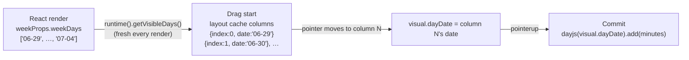
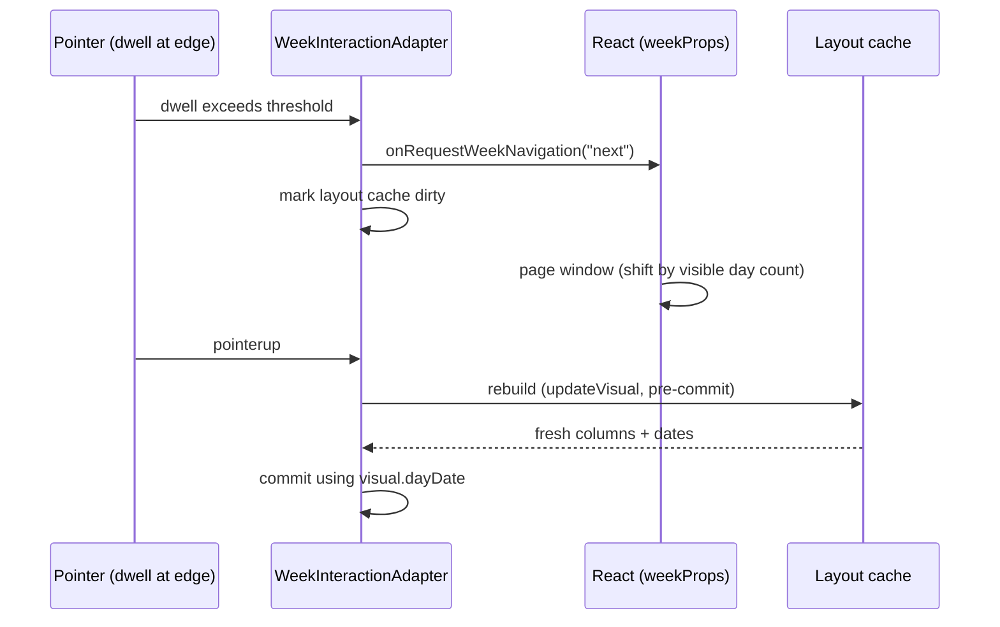

# Week Drag Interaction

How dragging a saved event on the calendar grid resolves the day it lands on.

## The one-sentence model

**A drag column knows its own date.** The layout cache built at drag start
carries `{ index, left, width, date }` for every rendered day column, sourced
from the same React render that painted them — so drag geometry and drop
dates can never disagree with what is on screen, even mid-gesture.

## Why this exists

The week view renders a *window* of 1–7 day columns (not always the full
week — see [Responsive Layout](./responsive-layout.md)).
Column **index** is window-relative (`0..N-1`), but earlier code seeded a
drag's starting day from `event.startDate.getDay()` — a week-absolute value
(`0=Sun..6=Sat`). The two only agreed when 7 columns rendered starting
Sunday. Once the window could shrink or start mid-week, the mismatch caused:

- drags that "stuck" partway across the grid (the wrong reference column
  corrupted the pointer-delta math)
- drops landing on the wrong day
- both getting worse after a mid-drag edge navigation, which used to bump a
  `weekOffsetDays` counter by a hardcoded `±7` — wrong whenever paging shifts
  by something other than a full week

## How it works now

Files:

- `packages/web/src/grid/interaction/layout.cache.ts` —
  `buildDayColumns` stamps each column with its date.
- `packages/web/src/views/Week/interaction/adapter/geometry/week-layout.cache.ts` —
  builds the week's timed/all-day caches from `visibleDays: string[]`.
- `packages/web/src/views/Week/interaction/WeekInteractionCoordinator.tsx` —
  supplies `getVisibleDays()` on the runtime from
  `weekProps.component.weekDays`.
- `packages/web/src/grid/interaction/types/timed-drag.types.ts`,
  `all-day-drag.types.ts` — visuals track `dayDate` / `initialDayDate` instead of
  a day-index-plus-offset pair.

Commit math differs by event type:

- **Timed** events assign the target day *absolutely*:
  `dayjs(visual.dayDate).startOf("day")` — safe because a timed event always
  renders in the column matching its own start date.
- **All-day** events use a *date-diff delta*:
  `dayjs(dayDate).diff(dayjs(initialDayDate), "day")` — required because
  multi-day spans are clamped to the visible window, so the initial column's
  date is the clamped visible edge, not necessarily the event's real start.

## Mid-drag week navigation

Dragging into the edge zone triggers `onRequestWeekNavigation`, which pages
the React window (by the visible day count, not always 7). No day-count
bookkeeping happens in the adapter — it only marks the layout cache dirty.
The pointer-engine already re-runs `updateVisual` (which rebuilds the cache)
immediately before `commit` on pointerup, so the drop always resolves against
the *freshest* rendered columns, whatever the navigation shifted.

## updateVisual Must Be Idempotent

`InteractionEngine.handlePointerUp`
(`packages/web/src/interaction/interaction.engine.ts`)
recomputes the visual by calling `adapter.updateVisual` with the release
pointer, then commits *that* result — it does not commit whatever the last
`requestAnimationFrame` produced. In effect, `updateVisual` runs once during
the final RAF frame and once more at pointerup, fed the first call's own
`visual` output as its input for the second call. So for a fixed release
pointer, feeding a math function's own output back into itself must produce
the same result again — the function must be idempotent under repeated
application with an unchanged pointer.

Any flip/branch logic inside an `updateVisual` math function must branch on
an **immutable** field captured at grab time (e.g. `initialEdge` in
`packages/web/src/grid/interaction/math/timed.resize.ts` and
`all-day.resize.ts`) — never on a field the function itself overwrites (e.g. a
mutated `activeEdge`). Branching on a mutated field diverges on the second
pass: the first call flips the edge and updates the field, so the second call
sees the *new* value and can flip again or compute a different result,
producing a wrong committed range specifically on edge-flip drags.

## Pitfall

Do not reintroduce a day-index-only visual (no `date` field) for any new drag
interaction on the week grid — window-relative indices are only meaningful
alongside the column dates they were built from in the same render.

## Drag-to-create in the all-day row

Pressing on empty space in the Week all-day row and dragging across day columns
creates a single all-day draft spanning every column the pointer crossed. The
gesture lives in `packages/web/src/grid/hooks/useAllDayDraftCreation.ts` behind
an opt-in flag, `isMultiDayDragEnabled`, and Week turns it on through
`packages/web/src/views/Week/hooks/grid/useAllDayGridDraftCreation.ts`. The Day
view calls the same hook without the flag and is unaffected: no flag, no window
listeners, and the one-day draft it produced before.

The lifecycle mirrors timed drag-to-create. Mousedown captures the anchor date
and the pointer origin, then registers capture-phase `mousemove` and `mouseup`
listeners on `window` plus a `blur` listener. Once the move threshold is
crossed, the first qualifying move calls `startGridDraft` with
`activity: "creating"` and every later move calls `setGridDraft` — the store
draft *is* the preview, so the all-day row renders the running span with no
component state. `mouseup` hands the resolved draft to the caller's callback;
`blur` and unmount cancel, removing every listener and discarding the preview
only if one had started. Range normalisation lives in the pure module
`packages/web/src/grid/interaction/math/all-day.create.ts`, so a right-to-left
drag and a left-to-right drag over the same columns produce the same schedule,
and the all-day exclusive-end convention (last dragged day plus one) is applied
in exactly one place.

### The clientY pin

**Every pointer→date resolution during the gesture passes the `clientY`
captured at mousedown, never the live move `clientY`.** This is not a
stylistic choice; dropping it reintroduces a silent date-rollover bug.

`getDateByXY` in `packages/web/src/grid/hooks/useGridCoordinates.ts` resolves
the column from x and then adds `getMinuteByY(y)` minutes to that column's
date. `getMinuteByY` floors at 0 but has **no upper bound**, so a pointer
dragged well below the grid yields more than 1440 minutes and the resolved date
rolls into the *next* day. Feeding the live y would therefore let a purely
vertical drag extend the span by a day. Upward excursion is safe because of the
floor; downward is not.

The threshold check is pinned the same way, which makes it horizontal-only for
free: `hasExceededInteractionMoveThreshold` ORs `|dx| > t` with `|dy| > t`, so
passing the pinned y makes `dy` identically zero and the test collapses to
`|dx| > t`. A purely vertical drag never crosses the threshold, never sets
`hasMoved`, and so never consults the pointer date at all. The rollover is
guarded twice over, and each guard has its own test in
`useAllDayDraftCreation.test.tsx`: *"resolves a diagonal drag from clientX
alone, ignoring the live y"* covers the resolver pin (it drags horizontally, so
the resolver really is consulted), and *"keeps a purely vertical drag on the
pressed column"* covers the x-only threshold (it asserts the store is never
written). Both fail if their guard is removed — a purely vertical drag alone
cannot prove the pin, because the threshold short-circuits before the resolver
is reached.

`ALL_DAY_DRAFT_CREATE_MOVE_THRESHOLD_PX` is deliberately its own constant in
`packages/web/src/interaction/interaction.constants.ts`. Do not fold it into
`TIMED_DRAFT_CREATE_MOVE_THRESHOLD_PX` or `INTERACTION_MOVE_THRESHOLD_PX` —
they measure different products of different gestures.

### Week click-to-create now completes on mouseup

Because the opt-in path registers a gesture, a plain click in the Week all-day
row now produces its draft on `mouseup` rather than on `mousedown`. The end
state is identical and the form still opens: `handleChange` in
`packages/web/src/views/Week/components/Draft/hooks/actions/useDraftActions.ts`
(lines 369-383) calls `setIsFormOpen(true)` when `activity === "gridClick"`,
and the effect in
`packages/web/src/views/Week/components/Draft/hooks/effects/useDraftEffects.ts`
(lines 62-64) re-runs it whenever its identity changes — which it does on the
`"creating"` → `"gridClick"` transition. The finished gesture therefore replaces
the preview in place rather than discarding and re-creating it, so there is no
flicker.

If you add a Week test that asserts a draft exists after a bare `mouseDown` on
the all-day row, fire `mouseUp` too. Do not "fix" it by moving the handoff back
to mousedown.
