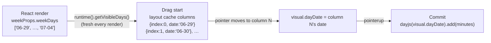
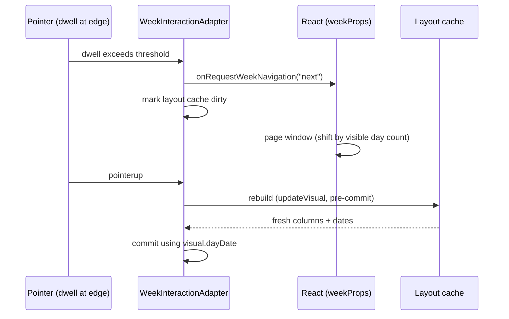

# Week Drag Interaction

How dragging a saved event on the calendar grid resolves the day it lands on.

## The one-sentence model

**A drag column knows its own date.** The layout cache built at drag start
carries `{ index, left, width, date }` for every rendered day column, sourced
from the same React render that painted them — so drag geometry and drop
dates can never disagree with what is on screen, even mid-gesture.

## Why this exists

The week view renders a *window* of 1–7 day columns (not always the full
week — see [Responsive Layout](./responsive-layout.md)).
Column **index** is window-relative (`0..N-1`), but earlier code seeded a
drag's starting day from `event.startDate.getDay()` — a week-absolute value
(`0=Sun..6=Sat`). The two only agreed when 7 columns rendered starting
Sunday. Once the window could shrink or start mid-week, the mismatch caused:

- drags that "stuck" partway across the grid (the wrong reference column
  corrupted the pointer-delta math)
- drops landing on the wrong day
- both getting worse after a mid-drag edge navigation, which used to bump a
  `weekOffsetDays` counter by a hardcoded `±7` — wrong whenever paging shifts
  by something other than a full week

## How it works now



Files:

- `packages/web/src/grid/interaction/layout.cache.ts` —
  `buildDayColumns` stamps each column with its date.
- `packages/web/src/views/Week/interaction/adapter/geometry/week-layout.cache.ts` —
  builds the week's timed/all-day caches from `visibleDays: string[]`.
- `packages/web/src/views/Week/interaction/WeekInteractionCoordinator.tsx` —
  supplies `getVisibleDays()` on the runtime from
  `weekProps.component.weekDays`.
- `packages/web/src/grid/interaction/types/timed-drag.types.ts`,
  `all-day-drag.types.ts` — visuals track `dayDate` / `initialDayDate` instead of
  a day-index-plus-offset pair.

Commit math differs by event type:

- **Timed** events assign the target day *absolutely*:
  `dayjs(visual.dayDate).startOf("day")` — safe because a timed event always
  renders in the column matching its own start date.
- **All-day** events use a *date-diff delta*:
  `dayjs(dayDate).diff(dayjs(initialDayDate), "day")` — required because
  multi-day spans are clamped to the visible window, so the initial column's
  date is the clamped visible edge, not necessarily the event's real start.

## Mid-drag week navigation

Dragging into the edge zone triggers `onRequestWeekNavigation`, which pages
the React window (by the visible day count, not always 7). No day-count
bookkeeping happens in the adapter — it only marks the layout cache dirty.
The pointer-engine already re-runs `updateVisual` (which rebuilds the cache)
immediately before `commit` on pointerup, so the drop always resolves against
the *freshest* rendered columns, whatever the navigation shifted.



## updateVisual Must Be Idempotent

`InteractionEngine.handlePointerUp`
(`packages/web/src/interaction/interaction.engine.ts`)
recomputes the visual by calling `adapter.updateVisual` with the release
pointer, then commits *that* result — it does not commit whatever the last
`requestAnimationFrame` produced. In effect, `updateVisual` runs once during
the final RAF frame and once more at pointerup, fed the first call's own
`visual` output as its input for the second call. So for a fixed release
pointer, feeding a math function's own output back into itself must produce
the same result again — the function must be idempotent under repeated
application with an unchanged pointer.

Any flip/branch logic inside an `updateVisual` math function must branch on
an **immutable** field captured at grab time (e.g. `initialEdge` in
`packages/web/src/grid/interaction/math/timed.resize.ts` and
`all-day.resize.ts`) — never on a field the function itself overwrites (e.g. a
mutated `activeEdge`). Branching on a mutated field diverges on the second
pass: the first call flips the edge and updates the field, so the second call
sees the *new* value and can flip again or compute a different result,
producing a wrong committed range specifically on edge-flip drags.

## All-day multi-day drag-to-select draft creation

Users can drag horizontally across the Week view's all-day row to create a multi-day draft event spanning multiple columns.

### Gesture lifecycle

The interaction in `packages/web/src/grid/hooks/useAllDayDraftCreation.ts` follows a four-phase lifecycle:

1. **`mousedown` (Initialization)**:
   - Captures the initial pointer position `pointerStart = { x: clientX, y: clientY }` and resolves `rawAnchorDate` via `getStartDate(clientX, clientY)`.
   - Computes an initial single-day schedule via `calculateAllDayCreateSchedule` clamped to `visibleBounds`.
   - Seeds the draft store in creating mode: `draftActions.startGridDraft({ activity: "creating", draft: currentDraft })`.
   - Attaches capturing window event listeners for `mousemove`, `mouseup`, `blur`, and `keydown`.

2. **Threshold detection (4px move threshold)**:
   - Movement does not update the draft until the pointer exceeds `TIMED_DRAFT_CREATE_MOVE_THRESHOLD_PX` (4px), evaluated via `hasExceededInteractionMoveThreshold(point, pointerStart, threshold)`.
   - Rather than defining a new constant, the all-day gesture deliberately reuses `TIMED_DRAFT_CREATE_MOVE_THRESHOLD_PX` from `@web/interaction/interaction.constants` for consistent drag sensitivity across timed and all-day surfaces.

3. **Live preview (`mousemove`)**:
   - Once the threshold is exceeded (`hasMoved = true`), each `mousemove` resolves `currentDate = getStartDate(clientX, clientY)`.
   - Recalculates start and end dates with `calculateAllDayCreateSchedule` and broadcasts the live preview via `draftActions.setGridDraft(currentDraft)`.

4. **`mouseup` (Commit)**:
   - Cleans up window listeners and commits the draft by invoking `onCreateGridDraft` (which promotes the draft to `activity: "gridClick"`) or `onCreateDraft`.

### Form opens on release (deliberate consequence)

On the Week all-day row, the draft form opens on **pointer release** (`mouseup`) rather than on initial press (`mousedown`). This is a deliberate, approved consequence (change plan section 11, Gate 2): an interaction cannot be classified as a click versus a multi-day drag until the pointer is released without exceeding the drag threshold.

The committed draft **value** is completely unchanged for a plain click — clicking a single column still resolves to that single day. Only the instant the draft form opens moves from press to release.

### Date math and normalization

Schedule calculation in `packages/web/src/grid/interaction/math/all-day.create.ts` is pure and handles boundaries and drag directions:

- **Visible bounds clamping (`clampDayToVisibleBounds`)**:
  Clamps both `anchorDate` and `currentDate` lexicographically to `[minDate, maxDate]`, preventing drags from expanding beyond the visible week window.
- **Right-to-left normalization (`normalizeDayRange`)**:
  Ensures `startDay <= endDay` lexicographically. Dragging leftward (backward in time) normalizes so that the leftmost column becomes `startDay` and the anchor becomes `endDay`.
- **Exclusive schedule end date (`toExclusiveAllDayEndDate`)**:
  All-day events in Compass store an exclusive end date (`lastInclusiveDay + 1 day`).
  *Worked example*: Dragging across Monday `2026-05-18` through Wednesday `2026-05-20` covers 3 inclusive days and produces:
  ```json
  {
    "startDate": "2026-05-18",
    "endDate": "2026-05-21"
  }
  ```
- **`calculateAllDayCreateSchedule`**: Orchestrates clamping, normalization, and exclusive end date calculation into an `{ startDate, endDate }` pair.

### Cancellation (Escape and window blur)

The gesture cancels cleanly if:
- The user presses `Escape` during the drag (`keydown` listener).
- The window loses focus (`blur` listener).

On cancellation, listeners are removed and `draftActions.discard()` resets the draft store without committing. Note that the timed draft creation gesture does not implement an Escape listener, making this dedicated cancellation behavior specific to all-day creation.

### Opt-in via `visibleBounds` and Day-view rationale

Multi-day drag creation is opt-in via the `visibleBounds` option on `useAllDayDraftCreation`:

- **Week view** (`packages/web/src/views/Week/hooks/grid/useAllDayGridDraftCreation.ts`): Passes `{ minDate, maxDate }` derived from `weekProps.component.weekDays` (`weekDays[0]` and `weekDays[weekDays.length - 1]`), enabling drag-to-select across visible days.
- **Day view** (`packages/web/src/views/Day/components/Calendar/DayCalendarGrid.tsx`): Omits `visibleBounds` (`undefined`). In Day view, columns along the x-axis represent different **calendars** (`displayedCalendars`), not days. Dragging horizontally across columns in Day view does not select a multi-day span. Therefore, Day view bypasses the drag gesture entirely and retains its synchronous `mousedown` draft creation path.

## Pitfall

Do not reintroduce a day-index-only visual (no `date` field) for any new drag
interaction on the week grid — window-relative indices are only meaningful
alongside the column dates they were built from in the same render.
